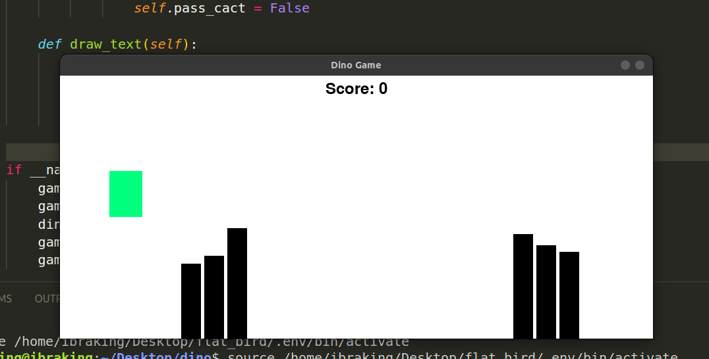

# Dino Game

## Description
Welcome to the Dino Game, a simple yet engaging Python-based game where you take control of a dinosaur character to navigate and conquer challenging cactus obstacles.

## How to Play
Playing the Dino Game is easy and fun:
- Press the `SPACE` key to command your dinosaur to leap over obstacles.
- Skillfully evade collisions with the menacing cactus obstacles that lie ahead.
- Keep an eye on your score as it increases with every successful obstacle cleared.

